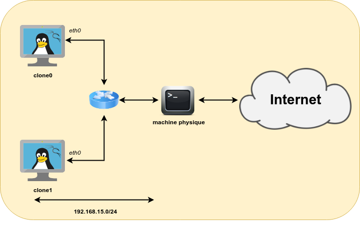
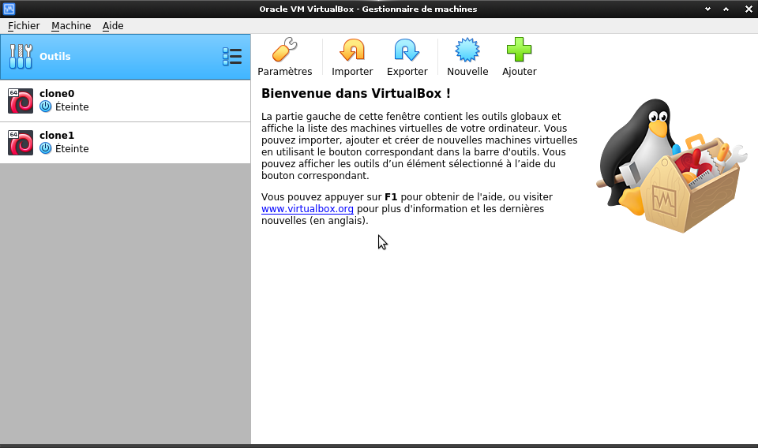
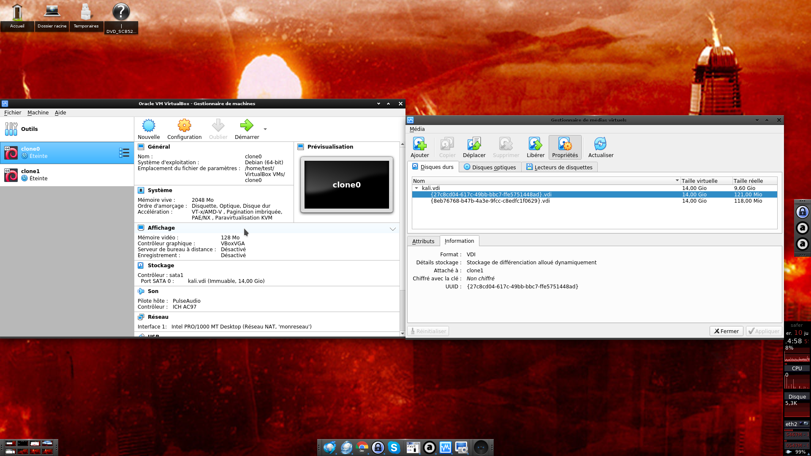
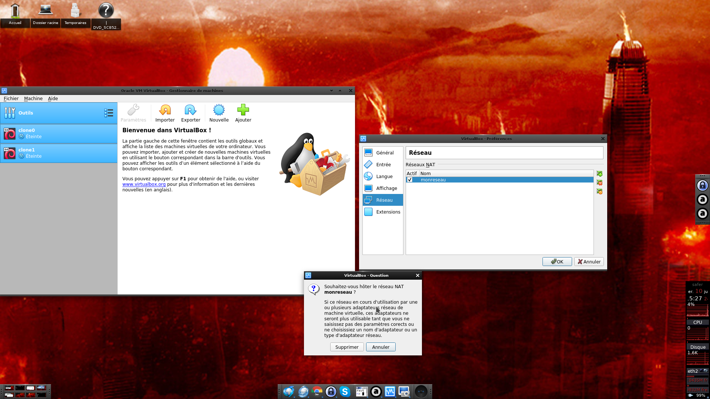

#Mise en place d'un réseau simple de machines virtuelles VirtualBox

##Prérequis

* Installer le logiciel VirtualBox ([https://www.virtualbox.org](https://www.virtualbox.org)).

* Télécharger l'image contenant l'installation du système en la
  téléchargeant depuis l'URL suivante:
  [https://mybox.inria.fr/d/491056058b/](https://mybox.inria.fr/d/491056058b/). L'archive
  contenant l'image s'appelle *kali.tgz*

* Télécharger le script python de configuration qui est disponible [ici](vbox.py). Le nom du script est *vbox.py*

## Description

Nous allons configurer VirtualBox de telle sorte qu'on puisse lancer n
machines virtuelles qui sont toutes dans un réseau local
(192.168.15.0/24) et qui auront accès à internet via la machine
hôte. Afin d'éviter de gaspiller de l'espace de stockage inutillement,
nous allons utiliser une seule image et dire à VirtualBox de ne
stocker que les modifications apportées à chacune des machines: Nos
machines seront à la base des clônes qui pourront se différencier si
besoin est. La topologie du réseau virtuel obtenu correspond à la
figure ci-dessous:

##Mise en place

* Éditer le script vbox.py pour définir les variables vdi (chemin
  d'accès à l'image sur la machine hôte) et vboxpath (répertoire
  d'installation de VirtualBox). vboxpath n'a besoin d'être définie
  que sur des machines hôtes windows.

* Lancer le script python vbox.py

Après l'exécution du script vbox.py, VirtualBox est a priori
correctement configuré. Il faut alors lancer le programme
VirtualBox. Vous devrez alors obtenir un affichage tel que celui ci:

Il suffit alors de démarrer les machines virtuelles appelées *clone0*,
*clone1*, etc. Pour ce faire, il suffit de double-cliquer sur chacune
des machines. Une fois cette étape effectuée, il y aura autant de
nouvelles fenêtres que de machines virtuelle. Le résultat devrait
ressembler à ceci:

##Remarques

* Le nombre de machines virtuelles est défini par la variable *nvm* dans
  le script python

* Les clônes sont configurés de telle sorte que les modifications
  apportées à chaque machine virtuelle sont perdues lorsque celle-ci
  est etteinte (i.e. les images sont réinitialisées à chaque
  redémarrage). Pour activer la conservation des modifications, il
  faut:
    * Ouvrir le gestionnaire de médias virtuels pour trouver le nom du
       disque associé à la machine virtuelle pour laquelle la
       persistance doit être activée

    * Il s'agît maintenant de noter l'UUID du disque qui correspond à
       notre machine (27c8cd04-617c-49bb-bbc7-ffe5751448ad dans notre
       exemple).    
    * Enfin, il faut utiliser l'utilitaire VboxManage (en ligne de
       commande) pour activer la persistance:
    
sous linux
    root@machine# VBoxManage modifyhd 27c8cd04-617c-49bb-bbc7-ffe5751448ad --autoreset off
sous windows:
    C:\> cd Program Files\Oracle\VirtualBox
    C:\Program Files\Oracle\VirtualBox> VBoxManage modifyhd 27c8cd04-617c-49bb-bbc7-ffe5751448ad --autoreset off

* Pour supprimer les machines virtuelles qui on été ajoutées, il
suffit de les sélectionner et d'utiliser le clic droit et sélectionner
supprimer (il est nécessaire de tout supprimer tous les fichiers). Il
est nécessaire aussi de supprimer les réseau virtuel qui a été créé
pour faire communiquer les machines virtuelles. Pour ce faire, il faut
cliquer sur paramètres et sélectionner réseau. Ensuite il faut
supprimer le réseau monreseau:

